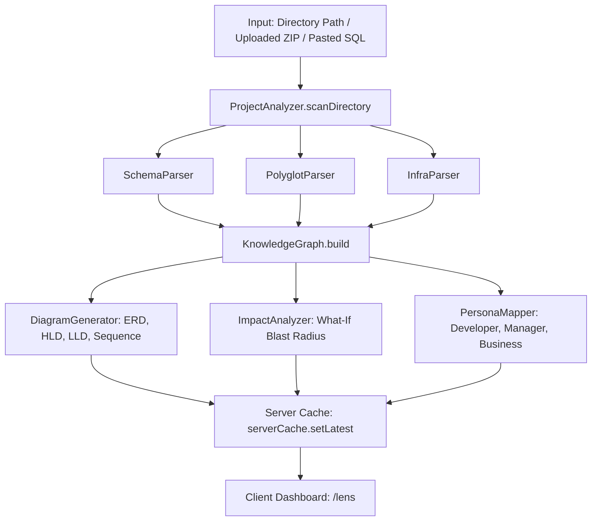

# System Architecture & Data Flow

BendLens operates through a clean, sequential data pipeline coordinated by `ProjectAnalyzer` (`src/lib/analyzer.js`):

## Detailed Pipeline Phases

### Phase 1: Directory Ingestion & Guards (`scanDirectory`)
- Filters ignored folders (`node_modules`, `.git`, `.next`, `dist`, `__pycache__`, etc.).
- Enforces safety ceilings: max 10,000 files, max 2MB per file.
- Collects an array of absolute file paths.

### Phase 2: Specialized AST & Schema Parsers
1. **`SchemaParser` (`src/lib/parsers/schemaParser.js`)**:
   - Parses table definitions, column types, primary keys, foreign keys, unique constraints, and sample data fixtures from SQL files, SQLite databases, and ORM models.
   - Deduplicates tables via case/underscore/plural-insensitive `tableKey()` + `upsertTable()` merge (e.g. SQL `users` + Prisma `User` + `order_items`/`OrderItem` merge into one entry with a union of columns/FKs) so table counts stay consistent across Header, ERD, HLD, LLD, and persona views. Sample-data and INSERT lookups use the same normalized key.
2. **`PolyglotParser` (`src/lib/parsers/polyglotParser.js`)**:
   - Regex- and AST-driven pattern scanner extracting classes, functions, imports, REST endpoints (`app.get`, `@app.route`, `@GetMapping`, etc.), and database access calls across JS/TS, Python, Java, Go, and C#.
3. **`InfraParser` (`src/lib/parsers/infraParser.js`)**:
   - Extracts Docker containers, ports, environment bindings, Docker Compose services, and OpenAPI contracts.

### Phase 3: Bi-Directional Knowledge Graph (`KnowledgeGraph`)
- In-memory directional graph constructed in `src/lib/graph/knowledgeGraph.js`.
- Maintains node sets and bi-directional adjacency maps (`adjacency` and `reverseAdjacency`).
- Connects disparate entities: Database tables <-> API routes <-> Services <-> Code modules.

### Phase 4: Downstream Generation Engines
1. **`DiagramGenerator` (`src/lib/generators/diagramGenerator.js`)**:
   - Compiles graph nodes and schemas into Mermaid diagram definitions (`erDiagram`, `flowchart TB`, `flowchart LR`, `sequenceDiagram`).
2. **`ImpactAnalyzer` (`src/lib/generators/impactAnalyzer.js`)**:
   - Evaluates consequences of renaming/deleting tables, columns, constraints, or endpoints. Calculates ripple nodes, affected code files, downstream FK failures, and risk scores.
3. **`PersonaMapper` (`src/lib/generators/personaMapper.js`)**:
   - Projects technical metrics into Developer, Engineering Manager, and Business Owner views.

### Phase 5: Storage & Presentation
- **Server Cache (`serverCache.js`)**: Keeps the active analysis in Node.js memory. This eliminates browser local-storage size constraints (5MB cap) when parsing massive enterprise schemas.
- **Client App (`src/app/lens/page.jsx`)**: Renders interactive diagram canvases with pan/zoom/export, persona views, data tables, and the blast radius simulator.
